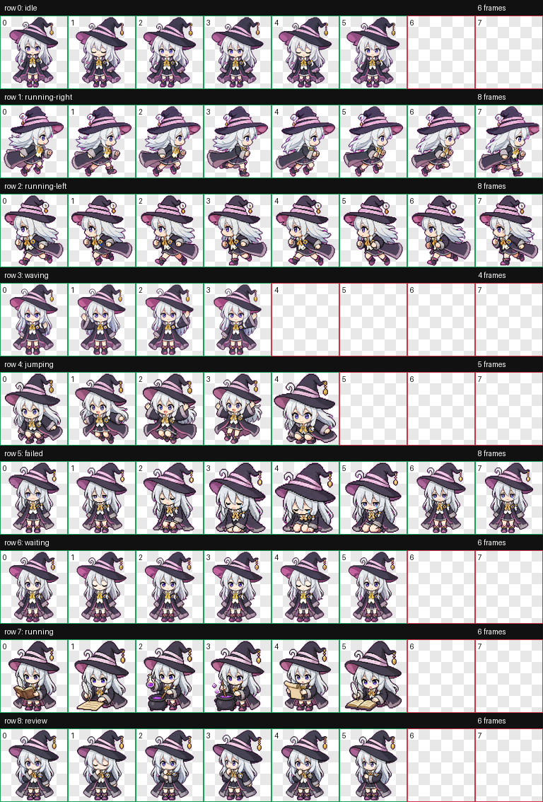

# Elaina Codex Pet



基于《魔女之旅》伊蕾娜形象制作的 Codex 自定义宠物资源。

## 包含内容

- `elaina-pet-run/final/spritesheet.webp`：最终宠物精灵图（可用于打包）
- `elaina-pet-run/final/spritesheet.png`：同内容 PNG 版本
- `elaina-pet-run/qa/contact-sheet.png`：动作总览图（便于人工检查）
- `elaina-pet-run/final/validation.json`：精灵图尺寸与布局校验结果
- `elaina-pet-run/qa/review.json`：逐行动画质量检查结果

## 使用办法

### 1. 安装到 Codex 宠物目录

将以下两个文件放入同一个宠物目录（目录名可自定义，例如 `elaina`）：

- `pet.json`
- `spritesheet.webp`

示例目录：

```text
~/.codex/pets/elaina/
  pet.json
  spritesheet.webp
```

> 本项目已生成的可用目录：`/Users/yelainab/.codex/pets/elaina`

### 2. 在 Codex 中启用

1. 重启 Codex（如果已打开）。
2. 进入宠物选择界面。
3. 选择 `Elaina` 即可。

### 3. 预览与验收（可选）

建议先查看以下文件确认效果：

- `elaina-pet-run/qa/contact-sheet.png`
- `elaina-pet-run/final/validation.json`
- `elaina-pet-run/qa/review.json`

## 项目结构

```text
elaina-pet-run/
  decoded/              # 每个状态的原始行图
  frames/               # 从行图提取后的逐帧图
  final/                # 最终精灵图与校验结果
  prompts/              # 生成提示词
  qa/                   # 联系图与QA报告
  references/           # 参考图和布局引导
```

## 说明

- 该宠物采用 Codex 数字宠物风格（Q 版、粗描边、有限色板）。
- 动作行包含 `idle`、`running-right`、`running-left`、`waving`、`jumping`、`failed`、`waiting`、`running`、`review`。
- 若你要二次修改形象，建议从 `elaina-pet-run/prompts/` 和 `decoded/` 开始迭代。
